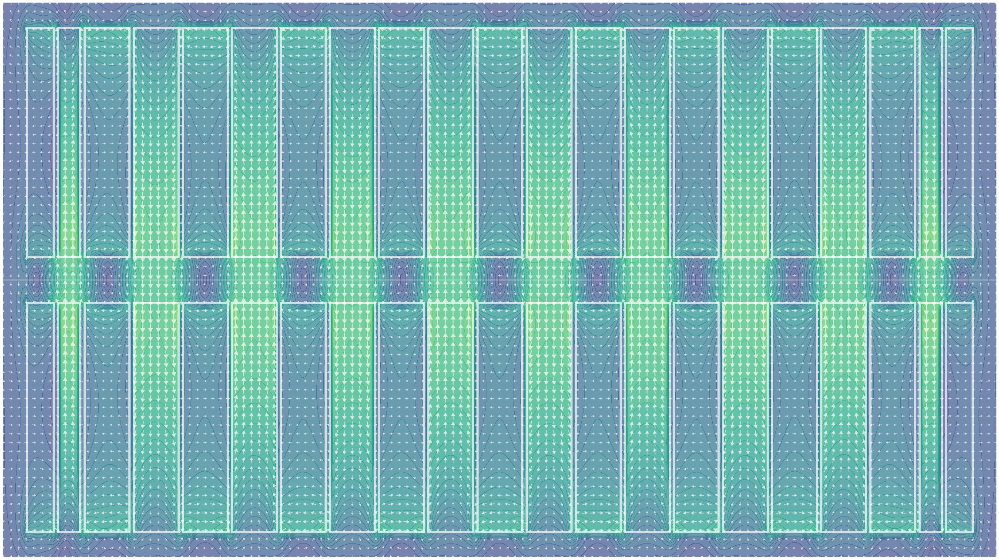
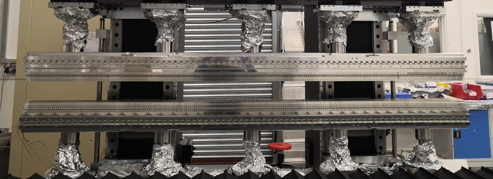
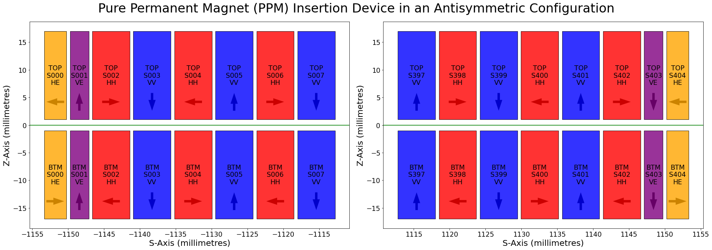
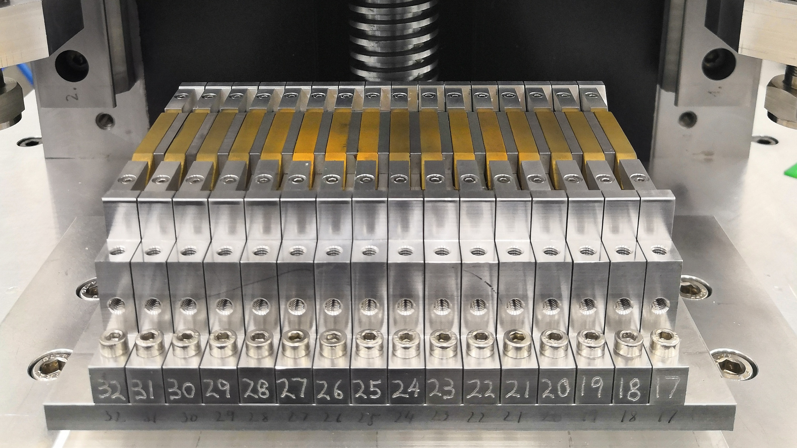
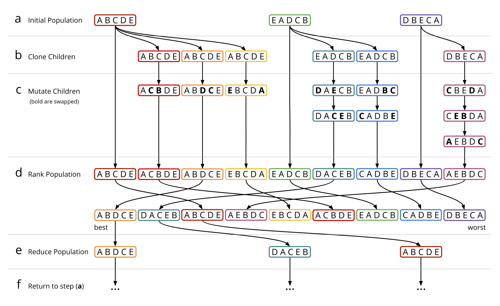

# Opt-ID: A System for Simulating and Optimizing Synchrotron Insertion Devices through Swarm Optimization

Code for the Optimisation of Synchrotron Insertion Devices using Python and Artificial Immune Systems.


| Branch  | CI | Coverage |
|:-:|:-:|:-:|
| `v3` (active) | [](https://github.com/rosalindfranklininstitute/Opt-ID/actions/workflows/ci.yml) | [](https://codecov.io/gh/rosalindfranklininstitute/Opt-ID) |
| `v1` | [](https://github.com/rosalindfranklininstitute/Opt-ID/actions/workflows/ci.yml) | [](https://codecov.io/gh/rosalindfranklininstitute/Opt-ID) |
| `v2`  | [](https://github.com/rosalindfranklininstitute/Opt-ID/actions/workflows/ci.yml) | [](https://codecov.io/gh/rosalindfranklininstitute/Opt-ID) |
| `v3`  | [](https://github.com/rosalindfranklininstitute/Opt-ID/actions/workflows/ci.yml) | [](https://codecov.io/gh/rosalindfranklininstitute/Opt-ID) |

---

### Example Hybrid CPMU device

```python
import logging
import optid
optid.utils.logging.attach_console_logger(log_level=logging.INFO)

from optid.constants import VECTOR_ZERO, VECTOR_S, MATRIX_ROTS_180
from optid.geometry import ChamferedCuboid, Cuboid
from optid.device   import HybridDevice, ElementSet

tetgen_kargs = dict(subdiv=0, nobisect=True)

mat_magnet = optid.material.NamedMaterial('Sm2Co17')
mat_pole   = optid.material.NamedMaterial('Ferrite')

hh = ElementSet(name='HH', candidates='sim/HH.csv',  vector=VECTOR_S, flip_matrices=[MATRIX_ROTS_180],
                geometry=ChamferedCuboid(shape=(50.0, 30.0, 5.77), material=mat_magnet, chamfer=5, **tetgen_kargs))

he = ElementSet(name='HE', candidates='sim/HEC.csv', vector=VECTOR_S, flip_matrices=[MATRIX_ROTS_180],
                geometry=ChamferedCuboid(shape=(50.0, 30.0, 3.48), material=mat_magnet, chamfer=5, **tetgen_kargs))

ht = ElementSet(name='HT', candidates='sim/HTE.csv', vector=VECTOR_S, flip_matrices=[MATRIX_ROTS_180],
                geometry=ChamferedCuboid(shape=(50.0, 30.0, 1.14), material=mat_magnet, chamfer=5, **tetgen_kargs))

pp = ElementSet(name='PP', vector=VECTOR_ZERO, geometry=Cuboid(shape=(20.0, 20.0, 2.95), material=mat_pole, **tetgen_kargs))
pt = ElementSet(name='PT', vector=VECTOR_ZERO, geometry=Cuboid(shape=(20.0, 20.0, 5.00), material=mat_pole, **tetgen_kargs))

device = HybridDevice(name='I14-CPMU', nperiod=4, symmetric=True, hh=hh, he=he, ht=ht, pp=pp, pt=pt)

print('nperiod', device.nperiod)
print('period_length', device.period_length)
print('nslot', device.nslot)
print('nslot_by_type', device.nslot_by_type)

pose = optid.device.Pose(gap=1, phase=0)
bfield = device.bfield(lattice=optid.lattice.Lattice(optid.core.affine.scale(1, 10, device.length * 1.1), shape=(1, 100, 100)), pose=pose)

print('bfield', bfield.field.shape)
```

```
nperiod 4
period_length 17.69000005722046
nslot 46
nslot_by_type Counter({'PP': 18, 'HH': 16, 'HT': 4, 'PT': 4, 'HE': 4})
bfield (1, 100, 100, 3)
```

---

Opt-ID provides a framework for handling and processing magnet and device configurations and utilities for composing optimization strategies to solve for optimal magnet configurations.

---

|   |
| :----------------------------------------------------------: |
| Figure 1: A simulation of the magnetic field in a Pure Permanent Magnet (PPM) Insertion Device. White solid lines denote the boundaries of magnet elements with alternating major field directions. Vectors denote the direction and magnitude of the magnetic field at each location. As an electron travels through the device along the centre-line (horizontal white line) it is oscillated by the alternating upward and downward field regions, encouraging it to emit photons travelling forwards along the beam path. |

Synchrotron Insertion Devices (ID) are systems of magnets used within straight sections of a synchrotron ring to convert energy stored in an electron beam into a photon beam which can be used for downstream science applications such as x-ray crystallography, spectroscopy, and tomography to name just a few. 

IDs contain many high-strength magnets held in close proximity, presenting significant technical challenges for design engineers. The design, construction, and tuning process is a time consuming and delicate task which can take months from first assembly through to ID commission and installation into a synchrotron. 

Small imperfections in manufacturing or damage to individual magnets mean that an arbitrary ordering of magnets used during construction may lead to an unacceptable accumulation of small errors along the length of the device, leading to poor performance of the ID or the exceeding of physical tolerances imposed by the design of the synchrotron.

Much of the work in tuning an ID is done manually by specialist ID physicists and engineers. At each synchrotron facility around the world these experts use a variety of strategies, but most often these can be summarized at a high level as a pattern of build, measure, modify, and repeat. A candidate ordering of some or all of the magnets is constructed, the magnetic field of the ID is measured along its length and visualized, and specialists then make informed decisions about where changes should be made to correct the errors that are observed within the ID. 

Modern IDs contain many hundreds (sometimes thousands) of individual and high-strength magnet elements, all of which will have small divergences from their intended sizes and magnetizations. This makes the combinatorial search space of distinct magnet orderings extremely large, where most of the orderings would perform poorly and comparatively very few orderings would perform well enough to be used.

Due to the long turnaround for trying out and measuring different magnet configurations, it is desirable to simulate the ID computationally to help determine an approximate magnet ordering before construction begins, significantly reducing the time needed to build and tune an ID. 

The Opt-ID software developed by RFI and Diamond Light Source (DLS) in collaboration with physicists at Helmholtz Zentrum Berlin (HZB) allows for efficient simulation of the magnetic fields produced by different candidate arrangements of magnets in an ID (figure 1) and provides an optimization framework for swapping and adjusting magnets within the ID to efficiently see how these changes would affect the magnetic field of the real device.

## Synchrotrons, Insertion Devices, and Magnets

In a synchrotron such as the one at DLS, a storage ring composed of a high-energy and tightly focused electron beam (3 GeV at DLS) is kept in a stable orbit around the ring at close to the speed of light. As the electron beam orbits it passes through multiple magnetic bending sections that curve the beam around in a complete circle. Between these bending sections there are straight sections several metres in length where IDs can be placed. 

An ID will often take the form of a set of rigid metal girders, several metres long, and held just a few millimetres above and below the path of the electron beam (figure 2). These girders are used to hold a series of small but extremely strong permanent magnets where each magnet in order will have its magnetic field aimed in an alternating direction relative to the neighbouring magnets.

|  |
| :----------------------------------------------------------: |
| Figure 2: A photo of the upper and lower girder of a Cryogenic Permanent Magnet Undulator (CPMU), holding many permanent magnets along its length, during construction at Diamond Light Source (DLS). |

As the electron beam passes along the centre-line path of the ID it is oscillated back and forth in a sinusoidal wave by the alternating magnetic field directions (figures 1 & 3). These oscillations cause the electron beam to dump its energy by emitting photons which continue to travel forwards along the beam path in a straight line to experiment chambers positioned tangentially to the synchrotron ring where the light can be used for scientific applications. The electron beam is then steered away using bending magnets so it can complete its orbit around the synchrotron ring and pass through the IDs again. 

By controlling the thickness of each magnet in the ID and their spacing, the period of the oscillations of the electron beam, and therefore the wavelength of the photons that will be emitted can be finely tuned. IDs installed in synchrotrons provide a way to produce extremely bright, focused, and consistent sources of light within a wide range of wavelengths, and are one of the foremost methods for producing powerful hard and soft x-ray beams which are difficult to produce at such high intensities and purities by other means.

|  |
| :----------------------------------------------------------: |
| Figure 3: A diagram showing the arrangement of magnets at the start (left) and end (right) of a Pure Permanent Magnet (PPM) Insertion Device. Arrows denote the major magnetic field direction of the magnet in each slot of the device. The green horizontal line denotes the path of the synchrotron electron beam which runs along the centre line of the ID. |

The magnets used to build an ID (figure 4) are in general manufactured by metal sintering, a form of 3D printing. These magnets are built to extremely accurate size and magnetization tolerances. However, deviances in manufacturing or minor scratches and damage will always exist as the magnets are brittle and under significant internal stresses from their magnetization. 

|  |
| :----------------------------------------------------------: |
| Figure 4: A set of sintered permanent magnets (gold coloured) installed in a section of the lower girder of a Cryogenic Permanent Magnet Undulator (CPMU) constructed at Diamond Light Source (DLS). |

The effect of these minor deviances over the several metres of length of an ID accumulate with one another as an electron passes along the device and can lead to degradation of quality of the photon beam by either not being tightly focused enough or emitting a range of different wavelengths of light rather than being focused around the single pure wavelength that was desired, or by degrading the quality of the electron beam by allowing it to drift away from the centre line of the ID preventing it from completing its orbit around the synchrotron. 

## Opt-ID: A Framework for Simulating and Optimizing for Magnet Arrangements

To compensate for the deviances in each magnet, the Opt-ID (Optimization of Insertion Devices) software has been developed by RFI and DLS to search for an optimal arrangement that available magnets can be placed in such that all of their individual errors and deviances cancel out one another yielding the brightest and most focused photon beam that is possible at the desired wavelength, while ensuring that the synchrotron electron beam quality is also maintained.

Opt-ID provides an extensible framework for modelling and simulating (figures 1 & 3) the magnet configurations of different types of ID, for mutating candidate magnet arrangements through operations such as magnet swaps, flips, and insertions, and for orchestrating the parallel optimization of multiple candidate orderings of magnets using swarm optimization. Using precise measurements of each magnet’s properties taken by the manufacturers and the ID specialists at DLS we can simulate the magnetic field contribution of each magnet if it were placed in each location of the ID.

An ID will consist of repeating patterns of different types of magnets, such as horizontally or vertically aligned magnets, or magnet types with different physical dimensions (orange and purple “end” magnets in figure 3). These patterns of different magnet types will be constant and fixed, but any candidate magnet of a matching type can be potentially placed in any slot for magnets of that type, often in either a flipped or un-flipped orientation. 

This means that a hypothetical ID with two types of magnets (horizontal and vertical), 100 candidate magnets of each type, 50 magnet slots for each type of magnet in the ID, where slots can accept each magnet in either a flipped or unflipped state, there are `(100 choose 50)^2 + 2^51 = 10^58` possible magnet arrangements that could be constructed. 

It is intractable to simulate every possible magnet arrangement to find an optimal one, even for relatively small devices like the one described above. In practice, real IDs are often much larger than the one described above and contain more than two types of magnet. 

## Swarm Optimization and Artificial Immune Systems

To tackle the large combinatorial search space Opt-ID leverages a class of strategies known as swarm optimization. At a high level, swarm strategies are those where multiple unique candidate solutions (different magnet orderings) are optimized together in parallel. The larger the swarm, the more candidates are considered at once, leading to better coverage over the search space of potential solutions. Often information from individual candidates is shared across the population in order to direct the swarm as a whole towards areas of the search space that appear to contain better solutions. 

Opt-ID uses a type of swarm optimization called an Artificial Immune System (AIS) which over multiple generations evolve a population of candidate solutions to explore the search space of possible magnet orderings (figure 5): 

- (a) The strategy starts with a population of magnet orderings that are randomly sampled for the first generation. 
- (b) For each candidate in the swarm multiple child orderings are cloned. 
- (c) The child orderings are mutated multiple times to explore similar orderings that may or may not be an improvement over the parent. 
- (d) The performance of each magnet ordering is then evaluated and ranked across the population. 
- (e) The best candidate orderings are kept to form the population for the next generation. 
- (f) The algorithm returns to step (a) and repeats the process of cloning and mutating child orderings using the current best population. 

|  |
| :----------------------------------------------------------: |
| Figure 5: A diagram showing the stages of the Artificial Immune System (AIS) algorithm. |

AIS provides a flexible and extensible framework for structuring combinatorial optimization strategies. The types of mutation that are applied can be crafted to be specific to the problem being solved. Mutations in Opt-ID generally mimic the types of operation the specialist ID physicists and engineers would perform when they manually tune an ID such as swapping two magnets, or flipping a magnet in its current location.

As can be seen in steps (b) and (c) in figure 5, the number of children generated from a parent ordering and the number of mutations performed on the children can vary and is in-practice controlled by heuristics that balance encouraging exploration of the search space with the stability of the optimization. The best performing candidates are given more clones to direct additional computation into searching around these orderings. Because those orderings are known to be good, a small number of mutations are applied to each of them to avoid damaging the properties that made them perform well. Conversely, the worse performing orderings in the population are given fewer clones which are mutated more times in the hope they will improve and move up in the ranking.

With each successive generation of the AIS algorithm it is possible for the candidates to survive to the next generation if they remain good enough compared to the rest of the population. If a parent's children do not outperform it after they are mutated then the parent will be more likely to survive to the next generation. When this happens repeatedly it indicates that the parent has found a either the global or a local minima in the search space where all of the surrounding candidates perform worse. If the parent is not currently the best performing candidate in the population then we know it must be a local minima because there are at least some areas of the search space that perform better. It would be preferable in such cases to remove the “stale” parent candidate so we can spend more time exploring elsewhere in the search space where we may be able to continue to improve. This is performed by tracking an age for each candidate that starts at zero when it is cloned from its parent and increases by one for every generation that it survives. If a candidate's age passes a threshold and the candidate is not the best one in the population it is removed from the population.

## Project Aims

A goal for the Opt-ID project is to continue to make the software flexible and extensible so that it can be used effectively at other synchrotron and FEL facilities around the world, and to allow for the optimization of new designs of state-of-the-art IDs. 

We are looking at GPU acceleration as a method to increase the efficiency of Opt-ID so that larger and more complicated IDs can be optimized in less time.

The “reality gap” is a common issue in simulated optimization domains and relates to the difference between in-simulation results and observed real world results. We plan to adapt Opt-ID with automatic registration techniques so that real world magnetic field measurements can be easily incorporated into the simulation process so that we can narrow the reality gap.

## Code

Opt-ID is released Open Source under the Apache-2.0 License, the code can be found on Github: https://github.com/rosalindfranklininstitute/Opt-ID

## Collaborators

Development of Opt-ID began as a project at DLS and is now continued as a collaboration between the AI team at RFI (Dr Joss Whittle, Dr Mark Basham) and the ID build team at DLS (Dr Zena Patel, Dr Geetanjali Sharma, Dr Stephen Milward) with additional collaboration with HZB (Ed Rial).
